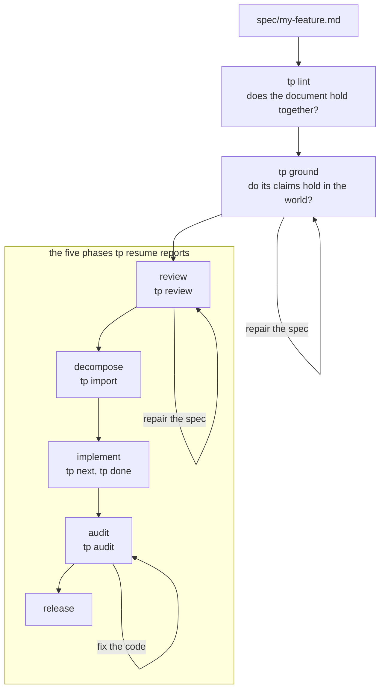
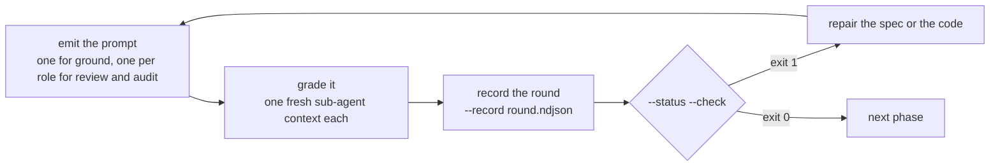
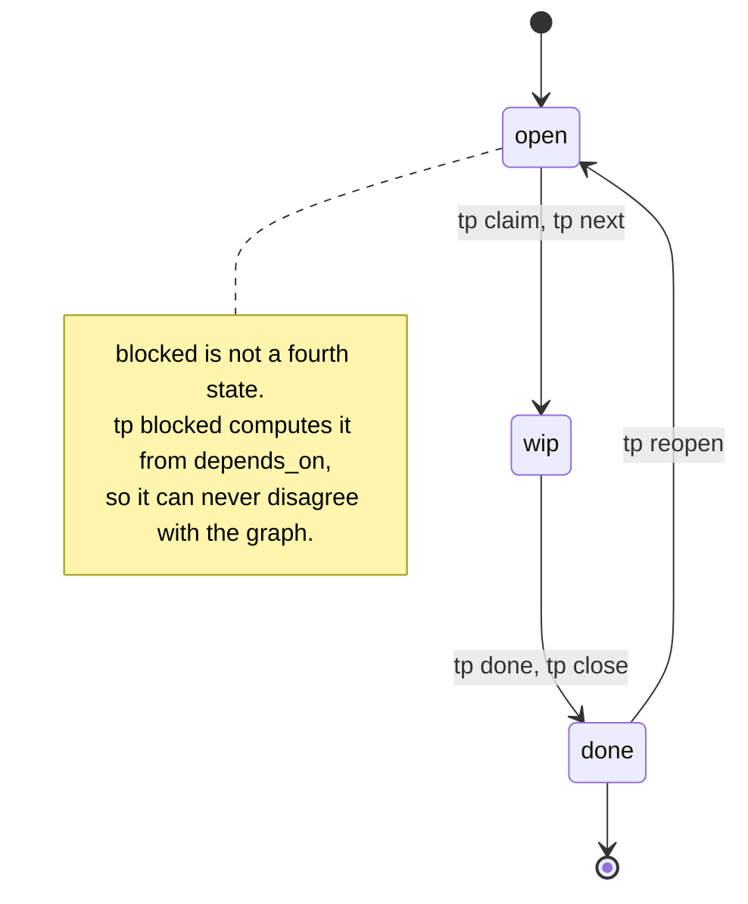

# tp — Task Plan

Spec-to-task lifecycle manager for AI coding agents.

Break specs into atomic, dependency-ordered tasks. Agents execute them with **2 tool calls** instead of hundreds.

> **tp's primary user is the AI coding agent, not the human.** Every command, flag, and output is designed for *AX* (Agent Experience): minimal round-trips, minimal output tokens, deterministic behavior (no prompts), and actionable error hints. The human authors specs and approves releases; the **agent plans and the tool executes**.

## Why

AI agents fail at long tasks. Research shows:
- **<15 min tasks: 70%+ success** (SWE-bench)
- **>50 min tasks: ~23% success** (SWE-bench Pro)
- **Each tool call costs ~200 tokens** of agent context

tp solves this with atomic task decomposition and a **2-call architecture**:

```
tp plan --minimal --json       # ONE call: get execution plan
# [agent implements each task, commits each one]
tp done --batch results.ndjson # ONE call: close everything
```

**Token overhead: ~5K** (vs ~54K with naive per-task tool calls).

## Install

```bash
# Homebrew (recommended)
brew tap deligoez/tap
brew install tp

# Go install
go install github.com/deligoez/tp/cmd/tp@latest

# Or build from source
git clone https://github.com/deligoez/tp.git
cd tp && go build -ldflags="-s -w" -o tp ./cmd/tp

# Install Claude Code skill (first time)
npx skills add -g deligoez/tp

# Update skill (after tp updates)
npx skills update -g
```

### Claude Code plugin (optional)

The skill above teaches the agent tp's workflow. The **plugin** adds what has to be true inside an
agent process: the brief arrives at session start, the scope fence is denied rather than requested,
and a role unit cannot stop before writing its findings. Install it if you use `tp run` or the
review/audit role units.

```bash
claude plugin marketplace add deligoez/tp
claude plugin install tp@tp
```

Update it with:

```bash
claude plugin update tp@tp
```

It ships the same `skills/tp`, so install **either** the plugin or the `npx skills` package, not
both. Claude Code namespaces a plugin skill (`/tp:tp`) separately from a standalone one (`/tp`), so
both load rather than one overriding the other — two entries for the same skill, kept up to date by
two different commands. Pick the plugin if you use Claude Code; it is the superset. To switch, run
`npx skills remove -g tp` after installing the plugin.

The binary is not inside the plugin: a marketplace is a git repository, so tp itself still comes
from Homebrew or `go install`. The `SessionStart` hook preflights tp's presence and version and
fails with the install command rather than degrading quietly, so a plugin newer than the installed
binary tells you so instead of misbehaving.

Verify what got installed — component inventory and its token cost — with:

```bash
claude plugin details tp@tp
```

## Quick Start

```bash
# 1. Create a task file from a spec
tp init spec/my-feature.md

# 2. Add tasks (or use tp import for bulk)
tp add '{"id":"create-model","title":"Create User model","estimate_minutes":8,
  "acceptance":"Model exists. Migration runs.","source_sections":["### User Model"],
  "source_lines":"15-42","depends_on":[]}'

# 3. Get the execution plan
tp plan --minimal --json

# 4. Implement, commit, and close each task
tp done create-model "User model at app/Models/User.php. Migration runs." --gate-passed --auto-commit
```

## Lifecycle

`tp resume` reports exactly five phases — `review`, `decompose`, `implement`, `audit`, `release`
(`internal/engine/phase.go`), derivable with `tp resume --json | jq .phase` across a cycle. `tp lint`
and `tp ground` are deliberately **not** among them. They are steps you run, not phases an oracle
tracks, and `tp run` makes the same omission concrete: it drives eight unit kinds
(`internal/engine/unitkind.go`) and none of them grounds anything, so no unattended run ever reaches
grounding. Ground is the one loop you have to remember.



Ground, review and audit are loops rather than steps, and they are the *same* loop — one shape, run
three times against three different questions:



What ends each loop is not the same condition, and that difference is the point:

| loop | `--status --check` exits 0 when |
|------|--------------------------------|
| `tp ground` | **coverage**: every emitted floor unit carries one of the six verdicts, and the floor is not empty |
| `tp review` | **absence**: `review_clean_rounds` trailing rounds carry no finding that `review_converge_on` counts, the spec has not moved since the last one, and every registered `checks` entry passes |
| `tp audit` | **absence**: `audit_clean_rounds` trailing rounds carry no row that `audit_converge_on` counts, under the same staleness rule |

The built-in defaults are 2 clean rounds for both, `blocking` for `review_converge_on` and `all` for
`audit_converge_on`; `tp config --resolved` prints what actually resolves in your repo and where each
value came from.

## Commands

One line per command — the index a human reads once to learn what exists. The exact forms, every
flag, and the workflows that use them live in the skill an agent loads every cycle:
[SKILL.md](skills/tp/SKILL.md).

### Primary Workflow
```bash
tp plan                        # Full execution plan (THE primary command; --minimal, --compact, --from, --level)
tp commit <id> [reason]        # Stage + structured commit + record SHA (--files)
tp done <id> <reason>          # Close with implicit claim + verification; runs the quality gate
tp done --batch file.ndjson    # Batch close from NDJSON
tp resume [spec]               # Report phase + the single next action from durable state (read-only)
tp brief [id]                  # The unit brief: identity, scope fence, prior work, close recipe
tp run [spec]                  # Drive the whole cycle unattended, one unit at a time (--status, --dry-run)
tp escalate --decision <name>  # Record an operator-only decision from inside a run and stop the unit
```

### Incremental (fallback)
```bash
tp next                        # Resume WIP or claim the next ready task (--minimal, --peek, --brief)
```

### Task State
```bash
tp claim <id> [id...]          # open → wip (--all-ready)
tp close <id> <reason>         # wip → done (low-level, prefer tp done)
tp reopen <id>                 # done → open (clears timestamps + SHAs)
tp remove <id>                 # Remove a task (--force cleans dependents)
tp set <id> field=value        # Update a field (--workflow, --project, --local, --bulk)
tp keep <path> "<reason>"      # Keep-list a deliberately-uncommitted file (--remove, --list)
```

### Query
```bash
tp list                        # All tasks (--status, --tag, --ids, --compact)
tp ready                       # Tasks with all deps satisfied (--first, --count, --ids)
tp show <id>                   # Full details + spec_excerpt + blocks
tp status                      # Progress summary (open/wip/done counts)
tp blocked                     # Tasks waiting on unsatisfied deps
tp graph                       # Dependency tree (--tag, --from)
tp stats                       # Parallelism analysis
tp report                      # Per-task duration + estimation accuracy
```

### Spec & Validation
```bash
tp lint spec.md                # Spec quality + structured element detection
tp ground spec.md              # Check the spec's claims against the world (--units, --record, --status --check)
tp review spec.md              # Adversarial review prompts, rounds, merge/resolve/record/status
tp review spec.md --role NAME  # Emit one role's prompt only (also on tp audit)
tp audit spec.md               # Post-implementation: verify the code matches the spec
tp validate                    # Task file + coverage + atomicity (--strict, --project)
```

### Data
```bash
tp init spec.md                # Create the task file shell (--eject-roles)
tp add <json>                  # Add a task (--stdin, --bulk)
tp import file.json            # Import + validate (--force, --spec)
tp use spec.tasks.json         # Set the active task file (--clear)
tp config                      # Effective project configuration (--resolved, --extract)
```

### Global Flags
`--file`, `--json`, `--compact`, `--quiet`, `--no-color` and their negations apply to every command;
[SKILL.md](skills/tp/SKILL.md) documents what each one does.

## Project Configuration

Multi-spec repos share **one** workflow policy instead of copying it into every `*.tasks.json` — so
an agent working across specs reads a single source of truth and cannot silently drift. A repo-root
`.tp/` directory holds it: `.tp/config.json` carries the shared workflow defaults (commit it),
`.tp/local.json` carries per-checkout state — the active task-file pointer, CLI flag defaults, and
`tp run`'s `notify_cmd`, which is per-operator rather than per-project — and is git-ignored
automatically, along with the run artifacts (`run-*.json`, `runs/`, `rounds/`, `locks/`,
`last_failure-*.json`). Effective values resolve at read time, so a task file's `workflow`
block holds only explicit overrides.

The layers, the `tp config` / `tp set --project` / `tp set --local` forms and the task-file discovery
order are in [REFERENCE.md](skills/tp/REFERENCE.md).

## Task File Format

Tasks live in a JSON file alongside the spec:

```
spec/
  my-feature.md              # spec (source of truth)
  my-feature.tasks.json      # tasks (derived, git-tracked)
```

Each task is atomic — one commit, one verb, ≤15 minutes:

```json
{
  "id": "create-model",
  "title": "Create User model",
  "status": "open",
  "estimate_minutes": 8,
  "acceptance": "Model exists. Migration runs.",
  "depends_on": [],
  "source_sections": ["### User Model"],
  "source_lines": "15-42"
}
```

Status is three values and no more — `open`, `wip`, `done` (`internal/model/task.go`) — with one
legal transition each way. Nothing writes a fourth:



The file's `workflow` block carries the gate and the convergence policy. Every field with its type,
default and range, the accepted acceptance-criteria delimiters, and the JSON field aliases are in
[REFERENCE.md](skills/tp/REFERENCE.md); how to write `source_sections` is in
[SKILL.md](skills/tp/SKILL.md).

## Closure Verification

tp refuses a lazy close, deterministically and language-agnostically: a task with N ≥ 2 acceptance
criteria needs N top-level evidence lines, "deferred"-style reasons are rejected, and a trailing
`Out of scope:` line is accepted. When
`workflow.quality_gate` is set, `tp done`/`tp close` run it automatically and a failing gate blocks
the close.

The exact rules, the close recipes per `commit_strategy`, and the user-approval escape hatches are
in [SKILL.md](skills/tp/SKILL.md).

## Reset-Native Workflow

tp's user is an AI agent whose context degrades over long runs, so every unit is meant to run in a
**fresh context**, with tp as the durable state machine between resets. `tp resume` reports the
lifecycle phase and the single next action from durable state alone, and
`tp brief` / `tp next --brief` hands a fresh unit everything it needs: identity, scope fence, prior
work, verbatim acceptance, and the close recipe for the effective `commit_strategy`.

**`tp run` drives that loop unattended.** It reads the cycle, spawns one runner process per unit —
the two role kinds concurrently, everything else alone — re-reads the state from disk, checks its
caps, and repeats. A unit's result is whatever it wrote to disk: tp reads a child's exit code and
one spend number, never its prose. The run exits **0** only when the cycle converged and **4** on
every other stop reason, so a caller never has to read the output to know what happened. Units run
with `TP_UNATTENDED=1`, under which the decisions reserved for a human — skipping the quality gate,
raising a round or run cap, forcing an import, relaxing the audit convergence policy — fail closed; a
unit records what it needs decided with `tp escalate` and the run stops for the operator. Which
runner to spawn, the caps, and the notification command are configuration, so the loop stays
runtime-neutral: built-in templates for `claude` and `opencode`, and a runner object for anything
else.

The loop, the unattended restrictions and the briefing duty are in [SKILL.md](skills/tp/SKILL.md);
the unit kinds, stop reasons, run state, child environment, `commit_strategy` and the keep-list are
in [REFERENCE.md](skills/tp/REFERENCE.md).

## Spec Quality

`tp lint` reports a spec's structured elements (tables, numbered lists, code blocks) — the
decomposition checklist — and its quality issues:

```bash
tp lint spec.md --json | jq '.findings[] | select(.rule)'
```

Every rule identifier tp can put in a `findings[].rule` field, and the command that emits it:

| Rule | Emitted by | Severity | What it checks |
|------|------------|----------|----------------|
| `heading-hierarchy` | `tp lint` | error | A heading skips a level (e.g. `##` straight to `####`) |
| `empty-section` | `tp lint` | error | A leaf heading with no body content (container headings — whose next heading is deeper — are skipped) |
| `duplicate-heading` | `tp lint` | error | Two headings with identical text under the same parent |
| `orphan-reference` | `tp lint` | error | `[text](#anchor)` whose anchor matches no heading |
| `frontmatter` | `tp lint` | error/warning | `tp:` frontmatter that is unclosed or unparseable (error), or whose shape is wrong (warning) |
| `section-size` | `tp lint` | warning | A section longer than 50 lines — consider splitting |
| `long-spec` | `tp lint` | info | Spec longer than 500 lines — consider modular sub-specs |
| `vague-language` | `tp lint` | warning | Vague wording: `appropriate`, `relevant`, `as needed`, `etc.`, `various`, `some`, `proper`, `properly` |
| `duplicate-line` | `tp lint` | warning | Consecutive identical non-empty lines (edit artifacts) |
| `duplicate-paragraph` | `tp lint` | warning | Two consecutive identical paragraphs — copy-paste artifacts the line-level check misses |
| `numbering-gap` | `tp lint` | warning | Gaps in numbered section headings (e.g., 4.1 → 4.3, missing 4.2) |
| `orphan-list-item` | `tp lint` | info | Numbered lists starting at >1 or with gaps (e.g., 1, 3 — missing 2) |
| `broken-cross-ref` | `tp lint` | warning | `§X.Y step N` where section X.Y has fewer than N numbered steps |
| `structured-elements` | `tp lint` | info | Tables, numbered lists, code blocks in spec |
| `acceptance-quality` | `tp lint` | warning/info | Task acceptance describing removal without final state or using a vague completion verb (warning), or shorter than 10 words (info) |
| `affected-files-scope` | `tp lint` | warning | Modify rows in affected files table without scope description |
| `schema` | `tp validate` | error/warning | Missing or invalid required task field (error); out-of-range `workflow` value, clamped at resolution (warning) |
| `atomicity` | `tp validate` | warning | `estimate_minutes` outside 1–15, title over 8 words or with a conjunction, over 2 `source_sections`, description over 300 chars |
| `self-dependency` | `tp validate` | error | A task that depends on itself |
| `dangling-reference` | `tp validate` | error | `depends_on` names a task id that does not exist |
| `circular-dependency` | `tp validate` | error | A dependency cycle between tasks |
| `duplicate-id` | `tp validate` | error | Two tasks share an id |
| `coverage` | `tp validate` | error/warning | Wrong `total_sections`, unmapped sections, coverage arithmetic that does not add up (error); spec missing or unparseable (warning) |
| `section-anchor` | `tp validate` | warning | A `source_sections` entry that matches no heading, or is ambiguous between several |
| `line-coverage` | `tp validate` | warning/info | Uncovered spec lines, unusable or invalid `source_lines` (warning); the "…and N more gap(s)" continuation (info) |

`tp import` runs the same task-file checks as `tp validate`, so it emits that half of the table too.

`tp ground` is the step before review, and the release that made tp 1.0. `tp lint` checks the
document's form, `tp validate` checks the plan against the spec, `tp audit` checks the code against
the spec — and until then nothing checked the spec against the world. Review reads the opposite
instruction: every role is handed *"the spec content above is complete and authoritative"*.

`tp ground` emits one prompt over a mechanically derived floor of the spec's own sentences and asks
for a disposition for each — `PASS`, `PARTIAL`, `FAIL`, `UNVERIFIABLE`, `QUESTION` or `NOT-A-CLAIM`,
with the `kind` of claim and the `tier` of evidence actually reached. A `PASS` whose tier says
nothing about that kind of claim, such as a behavioural claim confirmed by reading rather than by
running, is rejected at record. Convergence here is **coverage**, not absence:
`tp ground <spec> --status --check` exits 0 when every emitted floor unit carries a disposition —
with one further condition, because an empty floor makes that comparison vacuous: a document whose
every sentence the derivation's arms dropped exits 1 rather than certifying itself, and `--status`
reports the `cut` count the exit code turns on, so a driver can tell the two apart with the notice
suppressed. `--status` also reports the per-verdict breakdown beside the ratio — a spec whose every
claim was refuted is also 100% covered. From the second round a disposition carries forward for every
unit whose text has not moved, so a repaired spec is re-grounded where it changed rather than from
scratch.

`tp review` is told, not stopped: its envelope carries an `ungrounded` key while any floor unit is
undispositioned, and its exit code is the same with it and without it. The loop is in
[SKILL.md](skills/tp/SKILL.md); the row schema, the kind-tier sets and the exit codes are in
[REFERENCE.md](skills/tp/REFERENCE.md).

`tp review` generates the adversarial review prompts an agent feeds to sub-agents, records each
round, and makes convergence a recorded fact rather than a judgement. Roles are project-owned files,
per-spec focus comes from the spec's `tp:` frontmatter, and a recurring finding class can be
mechanized into a check. The round-by-round recipe is in [SKILL.md](skills/tp/SKILL.md); the roles,
frontmatter and finding contract are in [REFERENCE.md](skills/tp/REFERENCE.md).

`tp validate` checks line coverage — verifying that task `source_lines` cover the entire spec:

```bash
tp validate --json | jq .checks.line_coverage
```

## Post-Implementation Audit

`tp audit` verifies that the spec's requirements actually made it into the code. It emits one prompt
per auditor role over a spec-derived checklist and the affected files, records each round, and
reports whether the implementation diverges from the spec or the general lenses are simply reading
the rest of the repository. What a round must be clean **of** is `audit_converge_on`: the default
`all` counts every non-`PASS` row, and `blocking` — which stops advisory rows from holding a phase
open — is opt-in, human-only, and fenced at all four of its write paths under `TP_UNATTENDED`. The
round-by-round recipe is in
[SKILL.md](skills/tp/SKILL.md); the fields and the audit JSON schema are in
[REFERENCE.md](skills/tp/REFERENCE.md).

## AX (Agent Experience)

tp is designed for AI agents first (AX), not humans (DX):

| Principle | How |
|-----------|-----|
| **Minimal tokens** | `--minimal` ~80%, `--compact` ~40% smaller. 2-call architecture saves ~90% |
| **Batch parity** | `tp claim --all-ready`, `tp done --batch`, `tp set --bulk` |
| **Dependency-aware batch** | `tp done --batch` auto-toposorts by in-batch deps — no manual ordering needed |
| **Actionable errors** | Every error includes `hint` field with recovery action |
| **Did-you-mean** | `--covered-by` typos suggest similar task IDs |
| **Structured commits** | `tp commit` generates conventional commit messages with task metadata |
| **Implicit claim** | `tp done` and `tp commit` auto-claim open tasks |
| **WIP resume** | `tp next` returns existing WIP task (crash recovery) |
| **Covered-by** | Close tasks covered by other tasks without duplicate work |
| **Auto-normalize** | `source_lines` accepts `"72"` (normalized to `"72-72"`) |
| **Import flexibility** | `tp import` accepts bare JSON arrays with `--spec` flag |
| **Spec-only review** | Review prompts include disclaimer to prevent code-checking |
| **Edit hygiene lint** | `tp lint` detects duplicate lines/paragraphs, numbering gaps, and broken cross-refs |
| **Estimation calibration** | `tp add` warns when historical estimates are consistently high |
| **Duration tracking** | `tp report` shows per-task timing and estimation accuracy |
| **Entry validation** | `tp add` rejects bad tasks at entry (no id/title/acceptance/anchor), normalizes slices to `[]` |
| **Coverage on write** | `tp add`/`set`/`remove` recompute coverage, so init+add+validate is clean |
| **Audit file hint** | `tp audit` suggests files from done tasks' commits when none are detected |
| **Loop budget** | `--status` shows `max_rounds`/`rounds_remaining`/`in_flight_round` |
| **Divergence signal** | `tp audit --status`/`--record` report `role_streaks`, `spec_coverage_clean_rounds` and a `divergence` object |
| **Candidate retirement** | a registered check retires its mechanize candidate; `mechanized_classes` names what was withheld |
| **Unattended run** | `tp run` drives the whole cycle; exit 0 means converged, exit 4 names one of nine stop reasons |
| **Fail-closed decisions** | under `TP_UNATTENDED` the user-only decisions exit 2 and `tp escalate` records what needs deciding |
| **Audit convergence policy** | `audit_converge_on` (default `all`) decides what an audit round must be clean of; `blocking` is human-only, fenced at all four write paths |
| **Accepted rows are visible** | `tp audit --merge` breaks the round's non-`PASS` rows down as `by_severity`, and `next_action` names the accepted count |
| **Honest merges** | `--merge` reports `inputs` per file and exits 1 when a role's whole file failed to parse |
| **One prompt per unit** | `tp review`/`tp audit --role <name>` emit a single role's prompt, so a lost sub-agent costs one role, not the round |
| **Honest audits** | `file_summary.truncated`/`total_changed` put the 50-file cap in the payload, where `--quiet` cannot erase it |

## Claude Code Integration

tp ships a Claude Code skill via the [Agent Skills](https://agentskills.io) standard — installed and
updated with the `npx skills` commands under [Install](#install). The skill teaches the agent the
2-call workflow, decomposition rules, NDJSON format, closure verification, and commit conventions.

The repository is also a Claude Code **plugin**: `.claude-plugin/plugin.json` beside the marketplace
manifest, that same `skills/tp`, plus `hooks/` and `agents/`. **The binary is not inside it** — a
marketplace is a git repository, so installation stays Homebrew or `go install`, and the
`SessionStart` hook preflights `tp`'s presence and version and fails with the install command rather
than degrading quietly. It also injects `tp resume --compact` as orientation. A `PreToolUse` hook
denies hand-writes to tp's own state — `.tp-review/` contents, `*.tasks.json`, `.tp/config.json`,
`.tp/local.json` — and a `Stop` hook refuses a review or audit role unit's stop, once, while its
findings file is still missing and it has written no escalation record. `agents/` declares
`tp-implementer`, `tp-reviewer` and `tp-auditor`, carrying tool restrictions only: a role's content
lives in the corpus and reaches the unit through the prompt tp emits. Every hook is bounded by a
`timeout` of 10 seconds.

## Research

tp's design is backed by:

| Finding | Source |
|---------|--------|
| <15 min tasks = 70%+ success | SWE-bench |
| ACI design: 3-4x improvement | SWE-agent, Princeton |
| Planning: 9.85% → 57.58% success | Plan-and-Act |
| 100:1 input-to-output token ratio | Manus |
| 64% token reduction with upfront planning | ReWOO |

See [spec/0.1.0.md](spec/0.1.0.md) for the full specification with 22 research references.

## License

MIT
